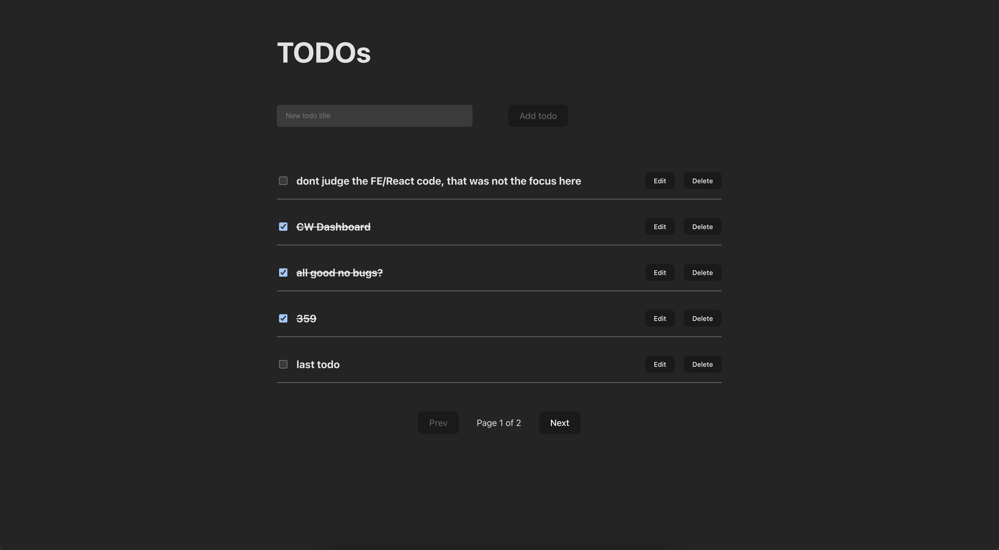
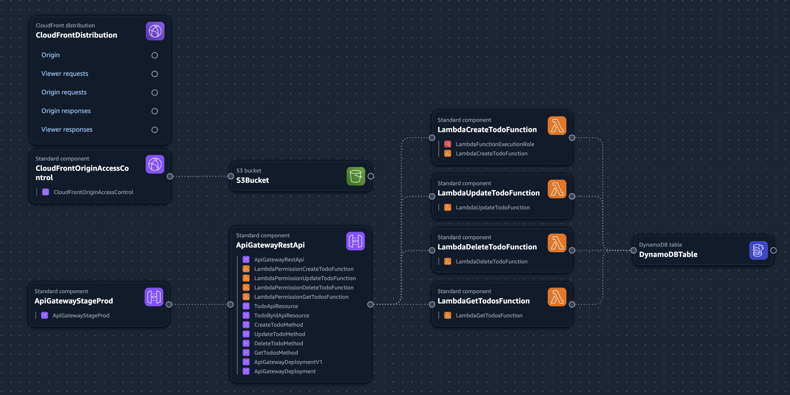

# Serverless Todo Application

This repository contains the full stack for a serverless Todo application, including the frontend code,
CI/CD workflows (GitHub Actions), Infrastructure-as-Code (IaC) template, and system architecture diagram.

---

## Live Demo
The application is available at:
https://d2gg6njvfiqvon.cloudfront.net

---

## Architecture Overview

- **Frontend**
  - S3 bucket hosts static web assets (React/HTML/JS).
  - CloudFront distribution delivers content securely with HTTPS.
  - Origin Access Control (OAC) ensures S3 is private and only accessible via CloudFront.

- **Backend**
  - API Gateway exposes REST endpoints (`/todos`, `/todos/{id}`).
  - AWS Lambda functions implement CRUD logic.
  - DynamoDB stores todo items.

- **Monitoring**
  - AWS CloudWatch collects logs and metrics from all services.
  - CloudWatch Alarms monitor error rates and latency.
  - Alarms are subscribed to an SNS topic for email notifications.
  - AWS X-Ray provide distributed tracing.

- **Security**
  - All data is encrypted at rest (DynamoDB SSE, S3 bucket encryption).
  - CloudFront OAC prevents direct access to S3.
  - IAM roles provide least privilege access to Lambda functions.

---

## Infrastructure

- **[CloudFormation template](./docs/infrastructure-template.yml)** defines:
  - S3 + CloudFront
  - DynamoDB
  - Lambda functions
  - API Gateway REST API
  - IAM roles & permissions

---

## CI/CD (Frontend)

The frontend React app is automatically deployed via **GitHub Actions**:

- On push to `main`, the workflow:
  1. Builds the React app  
  2. Uploads static files to the S3 bucket  
  3. Invalidates the CloudFront cache

- AWS access is handled via **OIDC**, providing short-lived credentials.

---

## Future Improvements

- Add WAF for additional API protection.
- Enable DynamoDB PITR for resilience.
- Configure a custom domain with **Amazon Route 53** instead of relying on the default CloudFront distribution domain.
